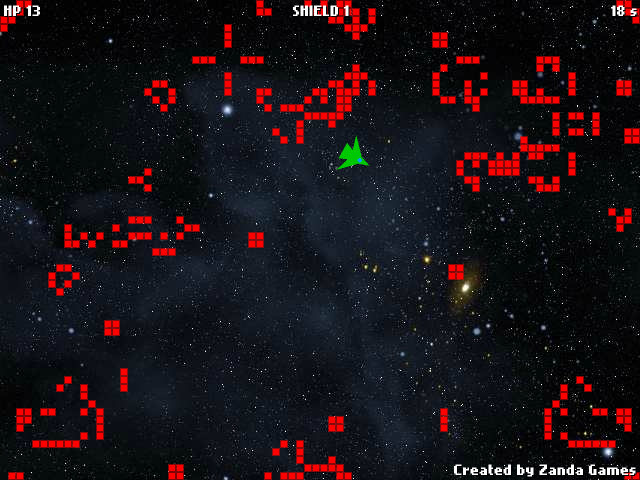

Game of Game of Life
====================

Red pixels follow the rules of [Conway's Game of Life](http://en.wikipedia.org/wiki/Conway%27s_Game_of_Life). If your spaceship touches them, it loses HP. Except when its shield is active, in which case the pixels touched are destroyed. Your goal is the annihilate all the pixels as fast as possible.

In the upper left corner is the HP of your ship, on the top in the middle is your shield (it loads continuously), in the upper right corner is the time elapsed. Control: speed up ship - UP key, slow down ship - DOWN key, steer ship - LEFT/RIGHT keys, activate shield - SPACE key.

Game of Game of Life was created by [Andras Nemeth](https://github.com/cu2) in 2011 for a Hungarian 72 hours game developer competition ([JátékFejlesztés.hu - I. Villámverseny](http://jatekfejlesztes.hu/page.php?&id=354), theme: Pixels).

Dependencies for compilation:
* [Flex 3.4.1](http://opensource.adobe.com/wiki/display/flexsdk/Flex+SDK) (probably works with other Flex v3 subversions)
* [Flixel 2.35](http://flixel.org/) (probably works with other Flixel v2 subversions)

Review from the competition's website:

> A klasszikus életjáték kicsit más szemszögből, összegyúrva egy másik klasszikusnak számító játékkal, az asteroids-al egy furcsa elegyet alkot, vártam már hogy mikor pattan be a pong labda, mellé a komolyzene már csak hab a torkán.
> Férfiasan bevallva elsőre nem sikerült legyőzni az inorganikus életet, ez valahol igazolása is annak életképességéről, persze utána a felsőbb intelligencia mégis diadalmaskodott, de csak mert kivártam amíg stabilizálódik minden ellenfél kis kockákba. Persze így nevetséges pontal zártam a csatát. A pajzs sem a megszokott star trekes módszerrel működik, ez keményen merül minden ütközés után, ha egy kicsit nem figyelünk oda könnyen otthagyhatjuk a fogunkat, mivel más fegyverünk nincs így ennek folyamatos újratöltődése miatt kell időnként kényszerpihenőre menni, közben lehet szemlélni hogyan burjánzik az ellen. Egy fegyver nem ártott volna. Meg egy logó sem, az innen is lemaradt.
